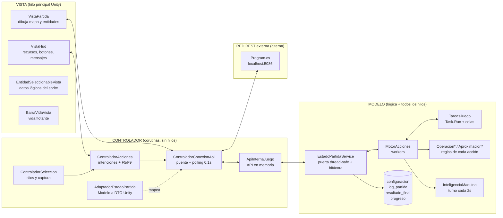
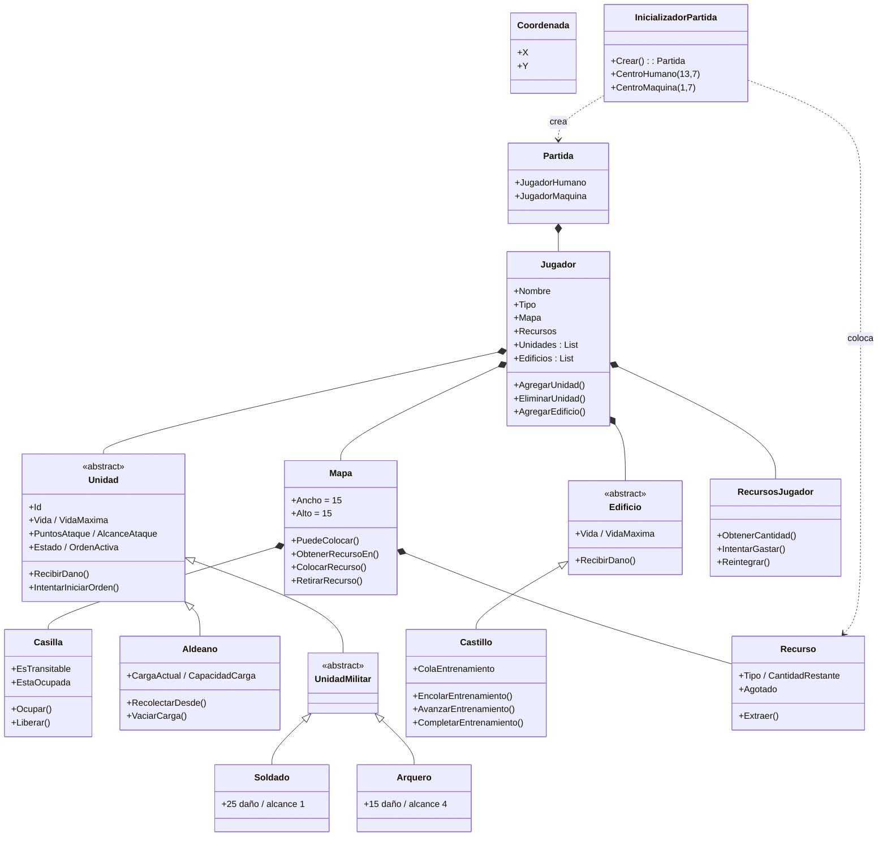
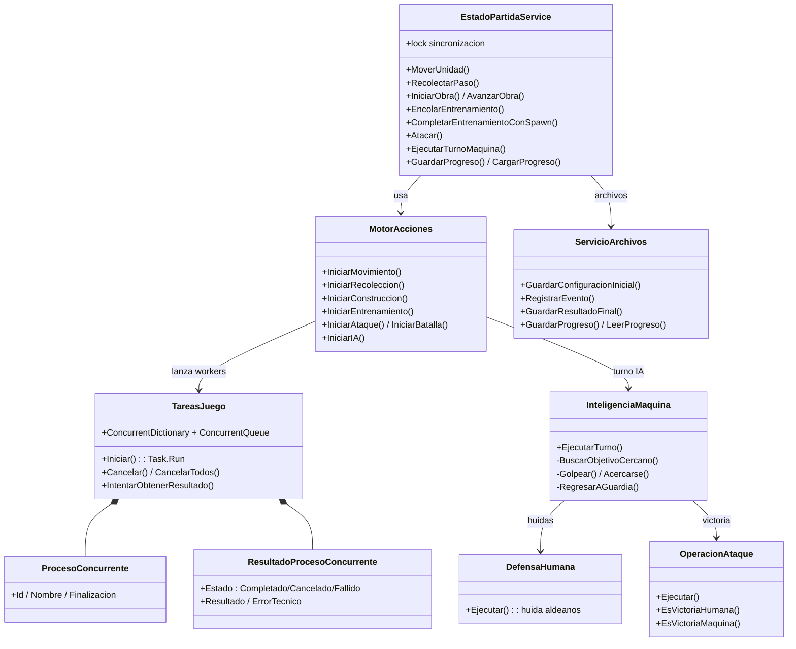
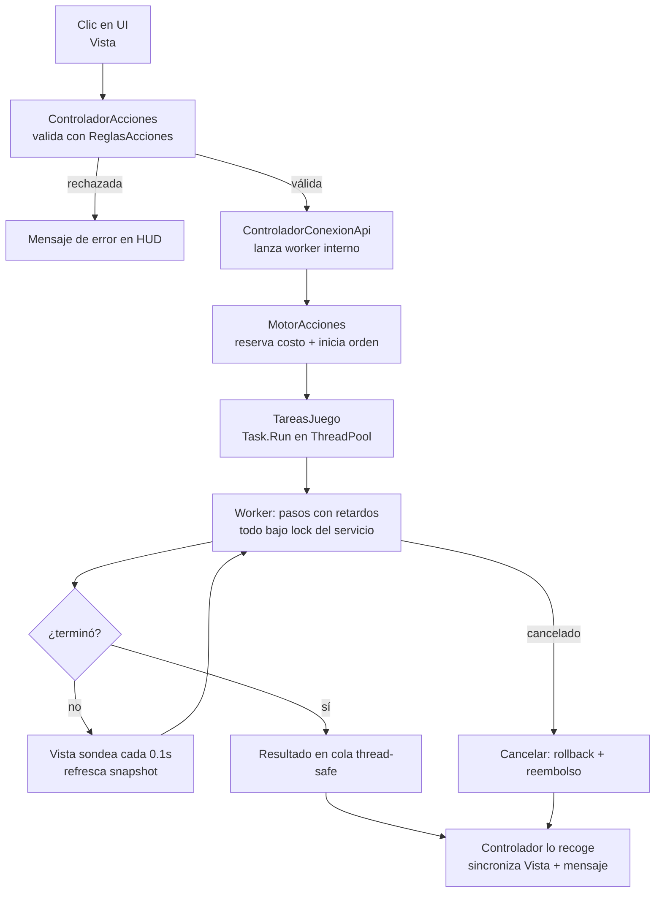
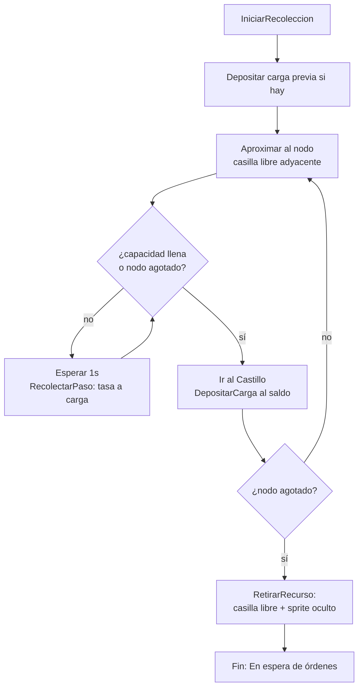
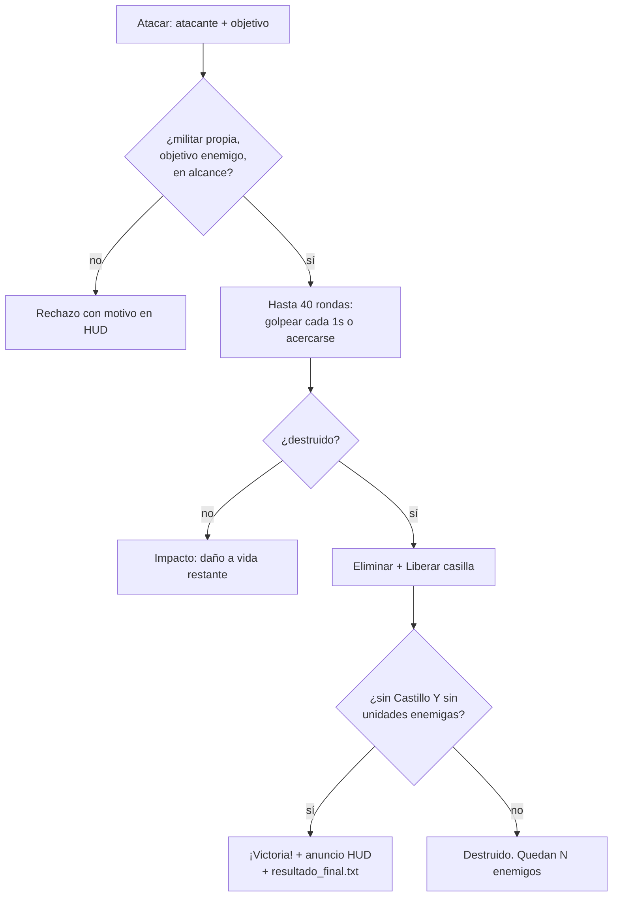
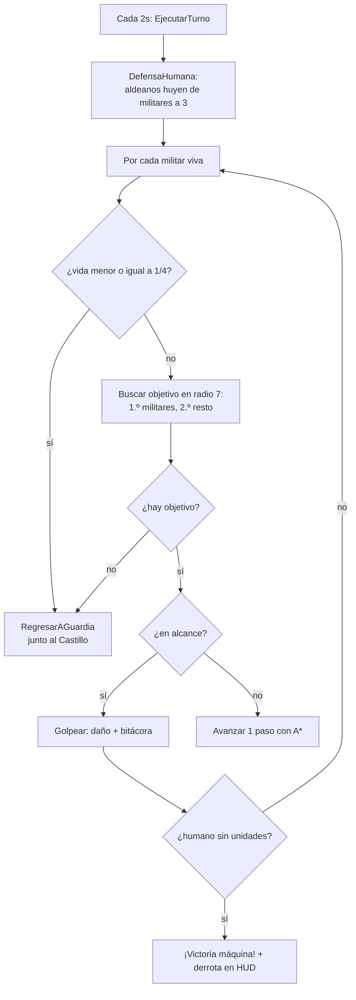
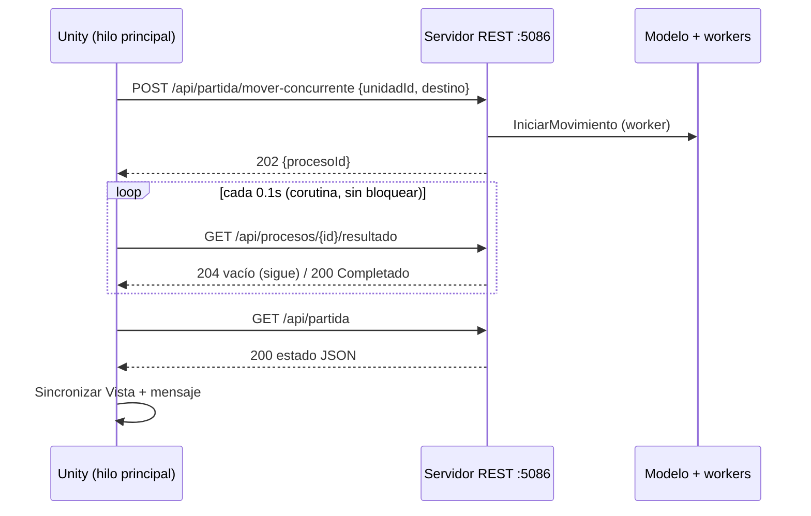

# Diagramas — Imperios en Guerra

Diagramas en Mermaid (se ven en GitHub): arquitectura MVC, clases por capa y flujos de las secciones críticas.

---

## 1. Arquitectura MVC y comunicación

**Lectura:** la Vista solo habla con el Controlador; el Controlador solo habla con el Modelo (o el servidor REST); el Modelo nunca llama a la Vista. Los hilos existen únicamente dentro del Modelo.

---

## 2. Diagrama de clases — núcleo del dominio

---

## 3. Diagrama de clases — concurrencia y servicios

---

## 4. Flujo general de una orden concurrente

---

## 5. Flujo de recolección (sección crítica)

---

## 6. Flujo de ataque y victoria

---

## 7. Turno de la máquina (IA)

---

## 8. Comunicación REST externa (modo alterno)

